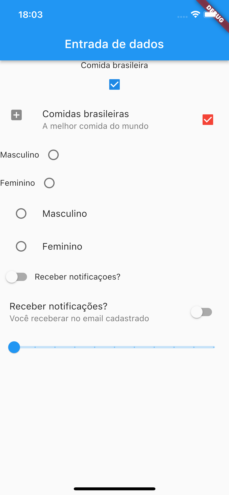

# Entrada de Dados

Aplicação criada para estudo sobre elementos de entrada de dados.

  

 
 

### Principais Widgets Utilizados

 

- Checkbox
- CheckboxListTile
- Radio
- RadioListTile
- Switch
- SwitchListTile
- Slider
